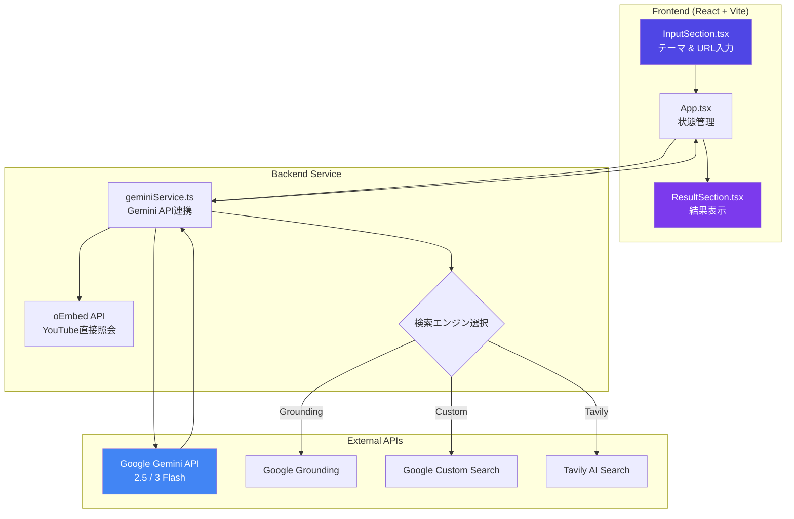
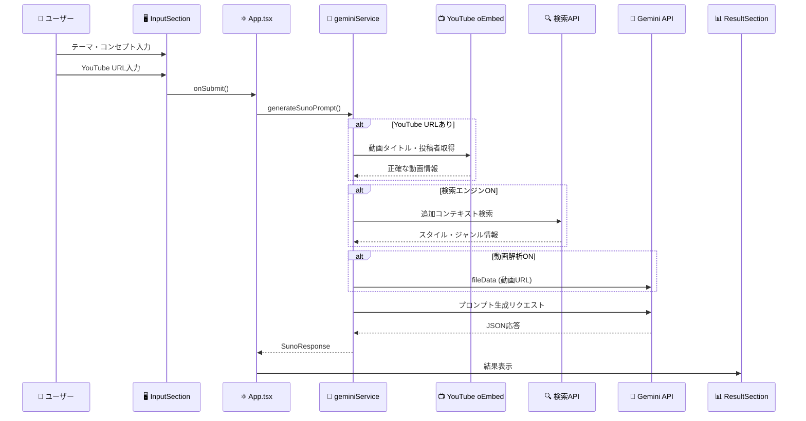
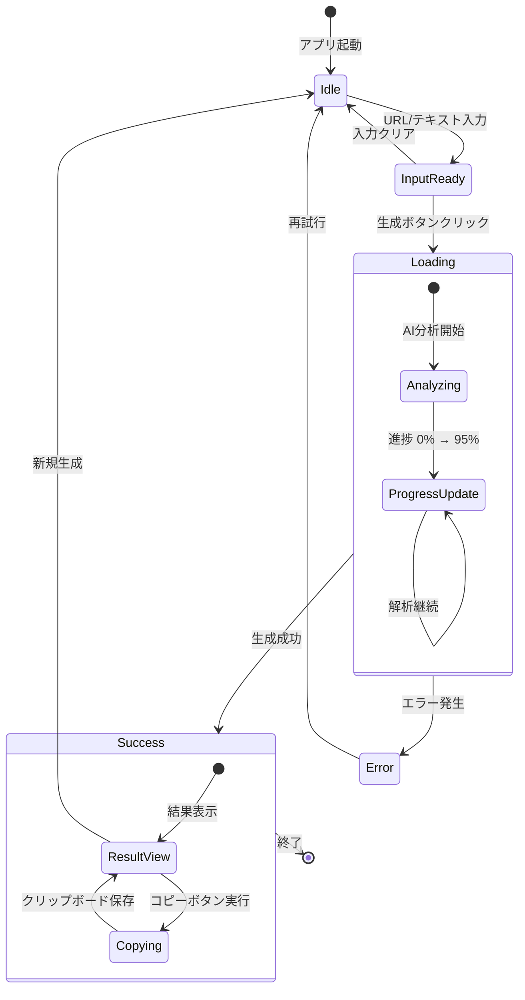

<div align="center">


# 🎵 Suno Architect v4.5

**AIパワードの音楽プロンプトジェネレーター for Suno.ai**

[](https://ai.google.dev/)
[](https://suno.ai)
[](https://www.typescriptlang.org/)
[](https://react.dev/)

</div>

---

## 📖 概要

Suno Architectは、YouTube動画やテキスト入力から**Suno.ai v4.5向けの最適なプロンプト**を自動生成するWebアプリケーションです。

Google Geminiの強力なAI機能を活用し、楽曲のスタイル、歌詞、構成を分析して、高品質な音楽生成パラメータを出力します。

### ✨ 主な特徴

- 🎯 **マルチプラットフォーム解析** - oEmbed APIを使用し、各種URLから詳細情報を取得
  - 対応: **YouTube, Spotify, SoundCloud, TikTok, Vimeo, X(Twitter), Instagram**
- 🎥 **動画コンテンツ解析** - Gemini APIで映像・音声を直接解析（オプション、YouTubeのみ）
- 🔍 **マルチ検索エンジン** - Google Grounding / Custom Search / Tavily AI対応
- 🎨 **スタイル候補生成** - 5つの異なるスタイルプロンプトを提案
- 📝 **歌詞自動生成** - メタタグ付きの完全な歌詞構成
- 🌐 **バイリンガル出力** - タイトル候補を日本語/英語で出力
- 🎭 **オリジナルアレンジ** - 元素材の完全コピーを禁止し、独自の解釈を加える
- 📊 **リアルタイム進捗表示** - 生成中のパーセンテージ表示

---

## 🏗️ システムアーキテクチャ



---

## 🔄 処理フロー（シーケンス図）



---

## 🚀 クイックスタート

### 必要条件

- Node.js 18+
- Google Gemini API キー

### インストール

```bash
# 依存関係をインストール
npm install

# 環境変数を設定 (.env.local)
GEMINI_API_KEY=your_api_key_here

# 起動用バッチファイル（Windows）
start.bat
# または
npm run dev
```

ブラウザで `http://localhost:3000` を開きます。

---

## ⚙️ 設定オプション

### AIモデル選択

| モデル | 説明 |
|--------|------|
| **Gemini 2.5 Flash** | 最新・安定版。バランスの取れた性能 |
| **Gemini 3 Flash Preview** | 最先端のプレビュー版。高度な解析能力 |

### 検索エンジン

| エンジン | 説明 | 設定 |
|----------|------|------|
| **OFF** | 検索なし（API節約） | デフォルト |
| **Google Grounding** | Gemini内蔵の検索機能 | 追加設定不要 |
| **Google Custom Search** | カスタム検索エンジン | API Key + CX必要 |
| **Tavily AI** | AI特化型検索 | API Key必要 |

### 環境変数

```env
# 必須
GEMINI_API_KEY=your_gemini_api_key

# オプション（検索エンジン用）
GOOGLE_CUSTOM_SEARCH_API_KEY=your_google_cse_key
GOOGLE_CUSTOM_SEARCH_CX=your_search_engine_id
TAVILY_API_KEY=your_tavily_key
```

---

## 📁 プロジェクト構造

```
suno-ai/
├── App.tsx                 # メインアプリケーション（状態管理）
├── index.tsx               # エントリーポイント
├── types.ts                # 型定義
├── utils.ts                # ユーティリティ関数
├── components/
│   ├── InputSection.tsx    # 入力UI（テーマとURLを分離）
│   └── ResultSection.tsx   # 結果表示（コピーボタン・分析表示）
├── services/
│   └── geminiService.ts    # oEmbed連携・Gemini API連携
├── vite.config.ts          # Vite設定（環境変数）
└── .env.local              # 環境変数（Git除外）
```

---

## 🎨 UI機能

### 入力セクション
- **テーマ・コンセプト** - 生成したい曲の雰囲気や歌詞のテーマを入力
- **URL (YouTubeなど)** - 解析のベースにしたいYouTube動画のURLを入力
- **画像・動画アップロード** - メディアファイルを直接解析
- **生成モード** - 自動 / 歌あり(Vocal) / 歌なし(Instrumental)
- **AIモデル選択** - Gemini 2.5 Flash / 3 Flash Preview
- **検索エンジン切替** - ON/OFFトグル + エンジン選択
- **動画解析トグル** - YouTube映像・音声の直接解析

### 結果セクション
- **分析結果** - 楽曲の特徴解説
- **タイトル候補** - 5つのバイリンガルタイトル
- **スタイル候補** - 5つのスタイルプロンプト
- **ベストセレクト** - 推奨プロンプト（タイトル・スタイル・歌詞）
- **変化球プラン** - 代替アプローチ

### コピー機能
- すべての候補にコピーボタン付き
- クリックで即座にクリップボードにコピー
- 成功時に緑色のフィードバック表示

---

## 🔒 コンテンツポリシー

Suno Architectは以下のルールに従ってコンテンツを生成します：

> ⚠️ **完全コピー禁止**
> - 元の楽曲のタイトル・歌詞をそのままコピーすることは禁止されています
> - 動画の概要欄、コメント欄、背景情報を参考に独自のアレンジを加えます
> - 元の世界観を尊重しつつ、新しい魅力を持つプロンプトを生成します

---

## 📊 状態遷移図



---

## 🛠️ 開発

### ビルド

```bash
# 本番ビルド
npm run build

# プレビュー
npm run preview
```

### 技術スタック

- **Frontend**: React 18 + TypeScript
- **Build Tool**: Vite 6
- **Styling**: Tailwind CSS
- **Icons**: Lucide React
- **AI**: Google Gemini API (@google/genai)

---

## 📝 ライセンス

MIT License

---

## � 参考URL・備考・メモ

- [Google Gemini](https://ai.google.dev/) - AI/ML API
- [Suno.ai](https://suno.ai) - 音楽生成プラットフォーム
- [Vite](https://vitejs.dev/) - ビルドツール
- [Tailwind CSS](https://tailwindcss.com/) - スタイリング
- [Lucide React](https://lucide.dev/) - アイコンライブラリ
- [Mermaid](https://mermaid.js.org/) - 図解生成エンジン

---

<div align="center">

**Made with ❤️ for Music Creators**

Powered by Google Gemini & Suno Architect Logic

</div>
