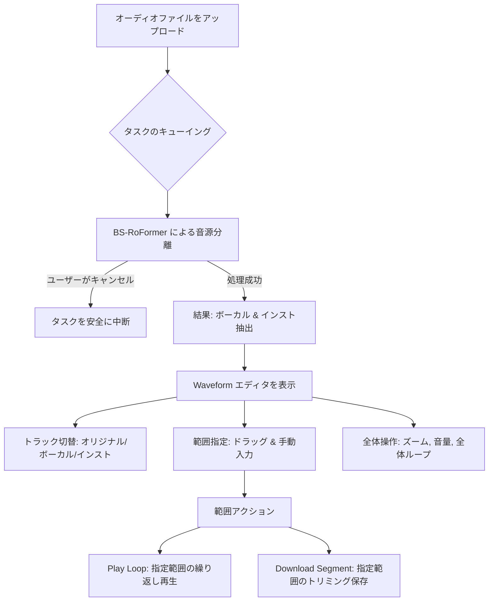

# Suno Architect Suite (v4.5 Hybrid)

Suno AI (v4.5) のポテンシャルを最大限に引き出すための統合開発環境です。
Gemini 2.5 Flash / 3.0 Flash Preview などの最新AIモデルを活用し、プロンプト生成から歌詞生成、MV制作支援までをワンストップで行えます。

## ✨ 主な機能

### 1. Advanced Prompt Generation
*   **Gemini 2.5 Flash / 3.0 Flash Preview Integration**: 最新の高精度・高速モデルを使用し、入力されたイメージから最適なSuno v4.5用プロンプトを生成します。
*   **Search Engine Integration**: Google Grounding、Google Custom Search、または Tavily を使用し、最新の音楽トレンドやアーティスト情報を加味したプロンプト作成が可能です。
*   **Suno URL Analysis**: 既存のSuno楽曲URLを入力すると、そのメタデータ（タイトル、プロンプト、スタイル）を解析し、それをベースに新しいプロンプトを作成できます。
    *   **New!**: `/s/` 形式の短縮URLにも対応。
    *   **New!**: メタデータが隠れている場合でも自動的にAPI等から情報を補完します。

### 2. YuE: Lyrics & Music Generation Support
*   (Experimental) 歌詞生成や楽曲構成案の作成をサポートします。

### 3. MV Production Support (Powerful!)
*   **High-Quality Audio Separation**: `audio-separator` (BS-RoFormer MDX23C-8KFFT-InstVoc_HQ model) を使用し、楽曲を「ボーカル」と「インスト（伴奏）」に極めて高精度に分離します。
*   **Advanced Waveform Editor**:
    *   **Multi-track Control**: オリジナル、ボーカル、インストを切り替えてプレビュー可能。再生位置を同期。
    *   **Precise Range Selection**: マウス操作、現在の再生位置からの設定、または `MM:SS.ss` 形式での手動入力による精密な範囲指定。
    *   **Loop Playback**: 全体のループ再生に加え、**選択範囲のみを繰り返す「Play Loop」機能**を搭載。
    *   **Cancellation**: 処理の途中で「キャンセル」が可能になりました。
*   **Smart Trimming & Download**: 指定した範囲のみを切り出して即座に `wav` ダウンロード。

### MV Production ワークフロー


---

## 🚀 セットアップと起動

### 1. 前提条件
*   Node.js (v18以上推奨)
*   Python (3.10以上推奨)
*   FFmpeg (パスが通っていること)
*   **GPU環境 (推奨)**: NVIDIA GPU + CUDA 11.x/12.x

### 2. インストール
リポジトリをクローンまたはダウンロードし、フォルダ内で以下のコマンドを実行します。

### 3. 環境変数の設定
ルートディレクトリの `.env.local` に必要なAPIキーを設定してください。

```env
# Gemini API
GEMINI_API_KEY=your_gemini_api_key

# Google Search (Optional)
GOOGLE_CUSTOM_SEARCH_API_KEY=your_google_api_key
GOOGLE_CUSTOM_SEARCH_CX=your_google_cx

# Tavily Search (Optional)
TAVILY_API_KEY=your_tavily_api_key
```

## 起動方法

```bash
# Windows
.\run.bat
```

アプリケーションが起動すると：
- **Backend (FastAPI)**: http://localhost:8000
- **Frontend (Vite/React)**: http://localhost:5173 (または 3000)

## 使用可能なAIモデル

| モデル名 | 説明 |
|---------|------|
| `gemini-2.5-flash` | 最新・安定版（推奨） |
| `gemini-3.0-flash-preview` | 最先端のプレビュー版 |

## 検索エンジンについて

| モード | 説明 | 必要なAPI Key |
|-------|------|--------------|
| Google Grounding (内蔵) | Gemini APIに内蔵された検索機能 | なし（Gemini API Keyのみ） |
| Google Custom Search | Google Programmable Search Engine | `GOOGLE_CUSTOM_SEARCH_API_KEY`, `GOOGLE_CUSTOM_SEARCH_CX` |
| Tavily AI Search | Tavily社のAI検索サービス | `TAVILY_API_KEY` |
| OFF (節約) | 検索機能を無効化（API使用量節約） | なし |

> **💡 ヒント**: oEmbed対応URL（YouTube, Spotify, Suno等）を入力すると、楽曲情報を自動的に解析します。

## ライセンス

MIT License
