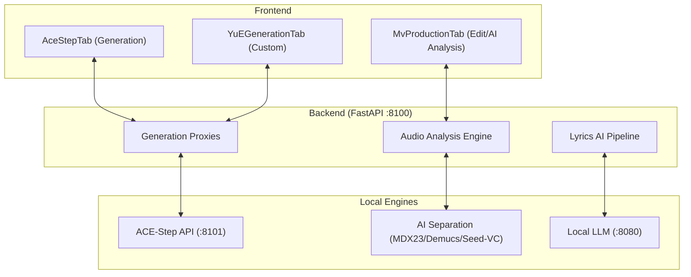

# Suno Architect Suite (v4.7 Hybrid)

Suno AI (v4.5/v5) のポテンシャルを最大限に引き出すための統合開発環境です。
Gemini 1.5 Pro / 2.0 Flash / 3.1 Pro などの最新AIモデルを活用し、プロンプト生成から歌詞生成、MV制作支援までをワンストップで行えます。

---

## ✨ 主な機能

### 1. Advanced Prompt Generation
*   **Dual-Brain Intelligence**: Gemini 2.5 Flash Lite (Default) / 2.0 Flash / 3.1 Pro 等を切り替え可能。
*   **Image-to-Prompt (New!)**: 参考画像から、音楽スタイルや雰囲気を読み取り、最適なプロンプトを生成。
*   **Search Engine Grounding**: Google Custom Search, Tavily AI を活用し、最新トレンドやアーティスト情報をプロンプトに反映。
*   **Suno URL Analysis**: `/s/` 短縮URLを含むSuno楽曲からメタデータを抽出し、そのスタイルを継承した新曲作成を支援。

### 2. MiniMax Music 2.5 Integration (Cloud Power)
最新の **MiniMax Music 2.5** モデルを用いた高品質な楽曲生成に対応。
*   **Music-2.5 Architecture**: より複雑な構成と高品質な音響特性を持つ楽曲を生成。
*   **Editable Style & Lyrics**: Gemini が生成した案を手動で微調整してから生成可能。
*   **Enhanced Stability**: タイムアウトを 600 秒に延長し、混雑時の安定性を確保。
*   **Real-time Progress Timer**: 生成中の経過時間を秒単位で表示。

### 3. ACE-STEP v1.5 Integration (Local & Limitless)
Suno AI 級の高品質な音楽生成を、**完全ローカル環境**で実現。
*   **ADG (Audio Directed Generation) (New!)**: 参考音源（リファレンストラック）を指定し、そのスタイルや音響特性を保ったまま新しい曲を生成。
*   **Multi-Stage Lyrics & Style Pipeline (Enhanced!)**: 
    1. **Direct Extract**: Suno APIから直接歌詞と楽曲スタイル（Tags）を抽出。
    2. **Smart Subtitles**: YouTube字幕（VTT形式）からクリーンな歌詞を抽出。
    3. **AI Style Generation (New!)**: 歌詞データをもとに、Gemini AIが最適なSuno v4.5向けスタイルプロンプト（タグ形式）を自動生成。
    4. **AI Whisper ASR**: 音声認識により、音源から直接歌詞を書き起こし、AIで構成をタグ付け。
*   **Creative Modes**: Text-to-Music / Cover (Style Transfer) / LoRA / Repaint.
*   **Post-Gen Vocal Replacement (Enhanced with Seed-VC)**: 
    - **Pro Tuning / 詳細設定**: Diffusion Steps, Pitch Shift, F0 Condition, Auto F0 Adjust などの精密な調整に対応。
    - **Quality Pipeline**: Demucs 分離後、MDX-Net による二次精製（Refinement）を行う高品質ボーカルクリーンアップ。
    - **Performance Metrics**: 変換にかかった全プロセス時間をリアルタイムに表示。
*   **Smart Settings Advisor (Updated!)**:
    - **Step Recommendation**: HQ制作には32ステップ以上を推奨。
    - **Thinking Mode Guidance**: 5Hz LMによる音楽設計プロトコルの詳細ヘルプを追加。
    - **Auto-Prompting**: Coverモード切り替え時に「Faithful cover, original melody...」を自動セット。

### 3. YuE: Advanced Generation (New Tab!)
最先端の音楽生成モデル「YuE」による、より細かな制御が可能な生成モード。
*   **Quality Profiles**: Best (8.0bpw) / Balanced / Fast 等、VRAM量に合わせた品質選択。
*   **Language Optimization**: 日本語 (jp-kr-cot) と英語 (en-cot) 各言語に最適化されたCoT（思考の連鎖）生成に対応。
*   **Structural Control**: セグメント数 (1〜4+) を指定し、30秒から2分以上のフル楽曲まで柔軟に作成。

### 4. MV Production Support (Pro Suite)
MV制作を加速させる、高度なオーディオ編集・解析ツール群。
*   **Universal URL Import (New!)**: YouTube (Shorts含む), TikTok, Suno.ai, SoundCloud 等のURLから直接オーディオを抽出・分離。
*   **Audio Separator (HQ)**: BS-RoFormer & MDX-Net 23C を使用し、ボーカルと伴奏を極限までクリーンに分離。
*   **CLAP Semantic Search (New!)**: 自然言語（「ギターソロ」「激しいドラム」等）で音源内の特定区間を瞬時に検索・特定。
*   **Audio Intelligence (New!)**: 波形解析により、BPM、キー、強度曲線（Intensity Curve）を自動検出。
*   **Seed-VC Integration**: MV制作時に分離したボーカルトラックに対して、リファレンス音声を用いた任意の声質変換を適用可能。
*   **Precision Waveform Editor**:
    *   **MM:SS.ss 直接入力**: ミリ秒単位での精密なトリミング範囲指定。
    *   **Dual-End Playback**: 選択範囲の開始点と終了点を個別に確認（Loop Playback搭載）。
    *   **Cloud Transfer**: ローカル生成された音源を即座にクラウドストレージへ保存・同期。

---

## 🏗️ アーキテクチャ


```mermaid
graph TB
    subgraph "Frontend"
        A["AceStepTab (Generation)"]
        B["MvProductionTab (Edit/AI Analysis)"]
        C["YuEGenerationTab (Custom)"]
    end

    subgraph "Backend (FastAPI :8100)"
        D["Generation Proxies"]
        E["Lyrics AI Pipeline"]
        F["Audio Analysis Engine"]
    end

    subgraph "Local Engines"
        G["ACE-Step API (:8101)"]
        H["AI Separation (MDX23/Demucs/Seed-VC)"]
        I["Local LLM (:8080)"]
    end

    A <--> D <--> G
    B <--> F <--> H
    C <--> D
    E <--> I
```

---

## 🚀 起動方法

### 1. サーバー一括起動 (推奨)
```powershell
# Windows
.\run.bat
```
以下のコンポーネントが自動的に起動します：
- **Master App**: http://localhost:5173
- **FastAPI Backend**: http://localhost:8100
- **ACE-Step Engine**: http://localhost:8101

### 2. 個別起動
- **フロントエンドのみ**: `npm run dev`
- **バックエンドのみ**: `python server/main.py`
- **ACE-Step APIのみ**: `.\run_acestep.bat`

---

## 💡 使用可能なAIモデル

| カテゴリ | モデル名 | 特徴 |
|---------|---------|------|
| **LLM (Planning)** | `gemini-2.5-flash` | 高速・高精度な楽曲設計 |
| **Music (Cloud)** | `MiniMax Music 2.5` | 最新のクラウド生成モデル |
| **Music (Local)** | `acestep-v15-base / turbo` | 柔軟なローカル生成、ADG対応 |
| **Custom Music** | `YuE (Best/Balanced/Fast)` | 専門的な音源生成 |
| **Analysis** | `CLAP`, `Whisper`, `RoFormer` | 音源解析・分離用 |

---

## 📝 ライセンス
MIT License - Developed for the Suno AI Community.
