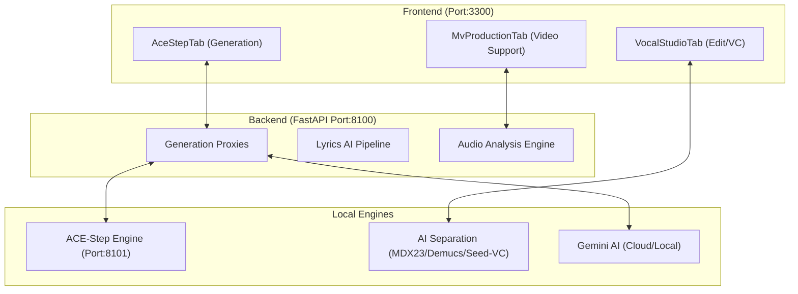

# ACE-Step Hybrid Suite (v1.5 Stable)

Suno AI 級の高品質な音楽生成をローカル環境で実現する、ACE-Step 1.5 世代に最適化された統合制作環境です。
Gemini 3 Flash / 3.1 Pro / 2.5 Flash などの最新AIモデルを活用し、プロンプト生成からボーカル編集、MV制作支援までをワンストップで行えます。

---

## ✨ 主な機能

### 1. ACE-STEP v1.5 Integration (Production Ready)
Suno AI 級の高品質な音楽生成を、**完全ローカル環境**で実現。
*   **Advanced Control**: 
    - **詳細パラメータ**: Duration, Guidance Scale, Seed, Batch Size, Thinking Mode を UI から直接制御可能。
    - **タスクモード最適化**: Cover, Repaint, Lego 各モードに特化した UI。
    - **Style Presets (New!)**: Suno v4 Emulation, Realistic, Vintage 等のプリセットを選択可能。
*   **ADG (Audio Directed Generation)**: 参考音源（リファレンストラック）を指定し、そのスタイルや音響特性を保ったまま新しい曲を生成。
*   **Creative Modes**: Text-to-Music / Cover (Style Transfer) / Repaint / Lego.
*   **Post-Gen Processing**: 生成後のフェードイン・アウト、無音部分の自動トリミング（Auto-Trim）を統合。

### 2. Vocal Studio (Precision Vocal Editing)
ボーカルの分離、声質変換（Seed-VC）、高品質なクリーンアップを実現。
*   **Quality Pipeline**: Demucs / BS-RoFormer による高品質分離。
*   **Voice Conversion**: リファレンス音声を用いた任意の声質変換を適用。
*   **Pro Tuning**: Diffusion Steps, Pitch Shift などの精密な調整に対応。

### 3. Advanced Prompt Generation
*   **Dual-Brain Intelligence**: Gemini 3.1 Pro / 3 Flash 等の最新モデルで音楽理論に基づいたプロンプトを生成。
*   **Image-to-Prompt**: 参考画像から、音楽スタイルや雰囲気を読み取り、最適なプロンプトを生成。
*   **Search Engine Grounding**: Google Custom Search を活用し、最新トレンドを反映。

### 4. MV Production Support
MV制作を加速させる、高度なオーディオ編集・解析ツール群。
*   **Universal URL Import**: YouTube, TikTok, Suno.ai 等のURLから直接オーディオを抽出。
*   **Audio Intelligence**: BPM、キー、強度曲線（Intensity Curve）を自動検出。
*   **Precision Waveform Editor**: ミリ秒単位での精密なトリミング範囲指定。

---

## 🏗️ アーキテクチャ


```mermaid
graph TB
    subgraph "Frontend (Port:3300)"
        A["AceStepTab (Generation)"]
        B["VocalStudioTab (Edit/VC)"]
        C["MvProductionTab (Video Support)"]
    end

    subgraph "Backend (FastAPI Port:8100)"
        D["Generation Proxies"]
        E["Lyrics AI Pipeline"]
        F["Audio Analysis Engine"]
    end

    subgraph "Local Engines"
        G["ACE-Step Engine (Port:8101)"]
        H["AI Separation (MDX23/Demucs/Seed-VC)"]
        I["Gemini AI (Cloud/Local)"]
    end

    A <--> D <--> G
    B <--> H
    C <--> F
    D <--> I
```

---

## 🚀 起動方法

### 1. 一括起動 (推奨)
Windows環境では、ルートディレクトリにあるバッチファイルを使用することで、フロントエンドとバックエンドを正しいポート設定で同時に起動できます。

```powershell
.\start_suno_mv.bat
```

- **Frontend**: http://localhost:3300
- **Backend**: http://localhost:8100

### 2. 個別起動
- **フロントエンド**: `npm run dev`
- **バックエンド**: `cd server && python -m uvicorn main:app --reload --port 8100`

---

## 💡 使用可能なAIモデル

| カテゴリ | モデル名 | 特徴 |
|---------|---------|------|
| **LLM (Planning)** | `Gemini 3.x / 2.5` | 高速・高精度な楽曲設計 |
| **Music (Local)** | `acestep-v15-base / xl` | 柔軟なローカル生成、ADG対応 |
| **Vocal / Separation** | `Seed-VC`, `RoFormer` | 声質変換・音源分離用 |
| **Analysis** | `CLAP`, `Whisper` | 音源解析・書き起こし用 |

---

## 📝 ライセンス
MIT License - Developed for the ACE-Step & Suno Community.
