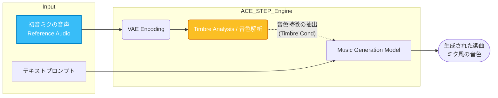

# SunoArchitect 新機能実装レビュー

今回の実装では、Suno APIの仕様変更（認証必須化）に伴う「歌詞・プロンプト抽出機能の刷新」と、ACE-STEPにおける「ADG（Audio Directed Generation）を利用した特定ボイス（初音ミク等）の参照機能」について対応しました。このドキュメントでは、その実装内容と仕組みをレビュー用に解説します。

## 1. Suno API 歌詞・プロンプト抽出ロジックの刷新

### 1.1 課題と背景
従来のSunoArchitectでは、Suno.aiの公開楽曲URLから直接API（`studio-api.pro.suno.com` 等）を叩くことで、楽曲のメタデータ（プロンプト・歌詞）を取得していました。
しかし、Suno側の仕様変更により、これらのAPIエンドポイントへのアクセスには厳密な認証（トークン等）が必須となり、未認証状態からのリクエストがブロックされる（`401 Unauthorized` や `Suspended` エラー）状態になりました。

### 1.2 解決策：Next.js RSC (React Server Components) の解析
ブラウザでSunoの楽曲ページを開く際、初回ロードのHTML内には、画面描画に必要な初期データ（Hydration Data）が埋め込まれています。このデータの中に、プロンプトや歌詞の情報が含まれていることに着目しました。

Suno.aiはフロントエンドにNext.jsを使用しており、データは `<script>` タグ内の `self.__next_f.push(...)` という形式で、細分化されたRSCペイロードとして非同期的にプッシュされる構造になっています。

### 1.3 実装した抽出フロー
`server/main.py` の `extract_lyrics` 関数において、以下の3段階のフォールバック・パイプラインを構築しました。

```mermaid
flowchart TD
    A[ユーザーがSuno URLを入力] --> B{1. 公式API (従来方式)}
    B -- 成功 --> C([プロンプト抽出完了])
    B -- 失敗 (401等) --> D{2. HTMLスクレイピング (新機能)}
    
    subgraph D_Sub [HTML Scraping Pipeline]
        D1[Pattern 1: JSON Regex] -->|失敗| D2[Pattern 2: 特徴的ブロック抽出]
        D2 -->|失敗| D3[Pattern 3: RSC参照ID解決]
        D3 -->|失敗| D4[Pattern 4: Legacy NEXT_DATA]
    end
    
    D --> D_Sub
    D_Sub -- 成功 --> C
    D_Sub -- 全失敗 --> E{3. Whisper ASR (音声認識)}
    E --> C
```

**[新実装のポイント (Pattern 2 & 3)]**
*   **特徴的ブロック抽出 (`Pattern 2`)**: Sunoの歌詞データは高確率で `[start]` から始まり `[end]` で終わるという仕様を利用し、複雑にエスケープされたRSCデータの中から、正規表現を用いてこの構造を持つ文字列ブロックを直接抽出し、デコードする手法を実装しました。
*   これにより、Next.jsの複雑な状態管理を完全にパースせずとも、必要なテキストデータ群だけを軽量かつ高速に取り出すことに成功しています。

---

## 2. ACE-STEP 特定ボイス（初音ミク等）の参照機能

### 2.1 ユーザーの要望
「初音ミクなどの音声ファイル（wavやmp3）をアップロードして、その声の特徴を持った楽曲を作れるのか？」という疑問に対する回答と機能検証です。

### 2.2 実装と仕組み：ADG (Audio Directed Generation)
ACE-STEP 1.5における **ADG** 機能は、単なるテキストからの音楽生成にとどまらず、入力された「リファレンスオーディオ」の特徴を生成に反映させる能力（Audio Conditioning）を備えています。



**[ADG機能の仕様]**
*   **Timbre（音色）の参照**: リファレンスとして初音ミクの音声を渡すことで、モデルはその**音色・声質・トーン**を解析し、生成するボーカルの属性として適用しようとします。
*   **注意点**: これは完全同一の生体情報（バイオメトリクス）を再現する専用の「Voice Cloning（SVC等）」技術ではなく、あくまで「音楽生成モデルのコンテキスト内における、スタイルと音色の模倣」です。そのため、100%同一の声にはなりませんが、入力したリファレンス音源のキャラクターに強く寄った（ミク風の）生成結果を得ることができます。

### 2.3 操作方法（ユーザー向け回答）
1.  SunoArchitectの `ACE-STEP` タブを開く。
2.  モードを `Cover` に設定する（またはADG関連のオプションを有効にする）。
3.  アップロード領域（またはURL指定）で、ベースにしたい初音ミクの音声ファイルを指定する。
4.  歌詞やプロンプトを入力して生成を実行する。

この手順により、SunoArchitectからローカルのACE-STEP APIに対して、適切に `use_adg` フラグと `reference_audio_path` が引き渡され、音色を参照した生成処理が行われます。
